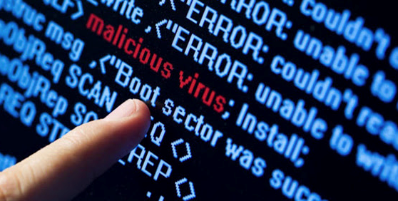
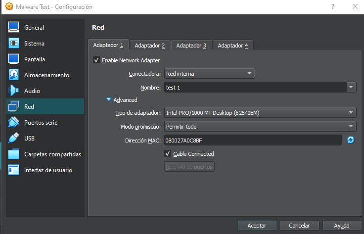

# Análisis de Malware Sandboxed

El análisis de malware es una rama de la ciberseguridad que, como su nombre indica, se enfoca en estudiar los programas maliciosos para comprender su diseño, estructura y comportamiento. A partir de estos estudios se pueden encontrar soluciones de defensa contra dichos programas y, por eso, son tan importantes para el desarrollo de parches de seguridad.

* **Análisis estático:** se refiere al estudio del código fuente del archivo malicioso. Esta fase permite prever los posibles comportamientos del malware y, además, no pone en riesgo de infección al equipo en el que se estudia.

* **Análisis dinámico:** se refiere al estudio del comportamiento del virus, por medio de su ejecución en una máquina virtual o sandbox. Se puede hacer de forma automatizada o manual.

* **Ingeniería inversa:** se refiera a ejecutar el programa malicioso paso a paso, con código ensamblado, con el fin de descubrir detalladamente cómo se ha diseñado y deducir la totalidad o algunos aspectos de su código fuente.

## Creación de un laboratorio analizar malware

**Herramientas:**

* [Virtualbox](https://www.virtualbox.org/)

* [Windows 8.1](https://www.microsoft.com/es-es/software-download/windows8ISO)

* [Remnux](https://remnux.org/)

**Demostracion:** https://www.youtube.com/watch?v=O5QQqR2-O28

## Configuración

Una vez instalado configuraremos el laboratorio de la siguiente manera:

Las máquinas virtuales deben estar en Red interna para poder analizar completamente y aislar el laboratorio de nuestra red.
