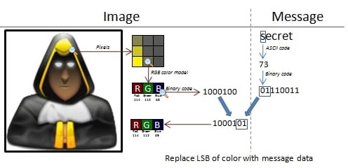

# Ocultar datos en una imagen

<br>

<p align="center">

</p>

<br>

Steghide es un software de esteganografía de código abierto que permite ocultar un archivo secreto en un archivo de imagen o audio. No notarás ningún cambio en la imagen o el archivo de audio. Sin embargo, el archivo secreto estará dentro de la imagen original o el archivo de audio. Es un software de línea de comando.

<br>

## Instalación

```
sudo apt-get install steghide
```

<br>

## USO

Primero vamos a crear un archivo de texto o el mensaje que vamos a ocultar

```
nano mensaje.txt
```

<br>

<p align="center">

</p>

<br>

Ahora vamos a descargar una imagen de internet la cual nos servira para poder ocultar el mensaje en este caso descargue una imagen de los caballeros del zodiaco

Luego para ocultar el mensaje usamos el siguiente comando

```
steghide embed -ef mensaje.txt -cf aioros.JPG
```

Nos pedirá una contraseña para el cifrado.

De este modo ya tenemos oculto nuestro mensaje dentro de la imagen.

Luego para extraer y descifrar el mensaje oculto usamos el siguiente comando, nos pedirá la contraseña que usamos anteriormente


```
steghide extract -sf aioros.JPG 
```

Y listo ya tendremos nuestro mensaje descifrado.
