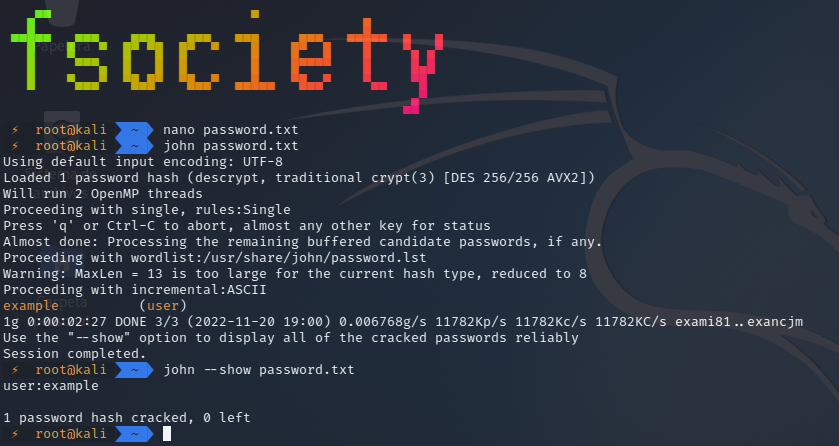
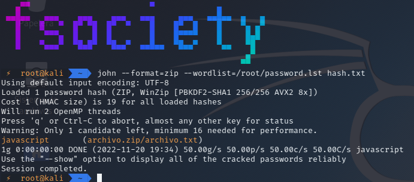

# Cracking con John the Ripper

<br>

<p align="center">

</p>

<br>

Para aquellos que aún no lo conozcan, John the Ripper es una herramienta de crackeo de contraseñas escrita en C y muy utilizada por los analistas de seguridad para comprobar la robustez de una clave frente a ataques de fuerza bruta. Este programa es capaz de romper los hashes MD5, SHA-1 y otros muchos ampliamente utilizados en el mundo informático.

<br>

## Instalación

```
sudo apt-get install john
```

<br>

## USO

### **Fuerza Bruta**

Podemos cargar directamente el archivo **/etc/shadow** que contiene las contraseñas de Linux y crackearlas, sin embargo, en este ejemplo vamos a crear un documento manualmente con un usuario y una contraseña y lo usaremos con John the Ripper.

Para ello creamos un nuevo archivo de texto llamado **password.txt**:

```
user:AZl.zWwxIh15Q
```

Vamos a indicar a John que empiece a trabajar para crackear la contraseña del archivo anterior.

```
john password.txt
```

Debemos esperar hasta que la herramienta consiga crackear la contraseña del anterior archivo.

La contraseña está crackeada. Para verla simplemente debemos utilizar el siguiente comando:

```
john --show password.txt
```

<br>

<p align="center">

</p>

<br>

### **Uso de diccionarios**

Lo que tenemos que hacer es tener o crear un diccionario de claves personalizado.

amos a crear nosotros un diccionario sencillo, al que llamaremos «passwords.lst» y en el que introduciremos varios valores, cada uno en una línea, pero siendo uno de ellos la palabra **example**.

Simplemente debemos ejecutar John the Ripper con el parámetro –wordlist= seguido de la ruta de nuestro archivo:

```
john --wordlist=passwords.lst password.txt
```

Ahora debemos utilizar el parámetro –show para que nos muestre el resultado.

```
john --show password.txt
```

<br>


### **Descifrar contraseña de archivos comprimidos**

Para esto deberemos tener un diccionario y un archivo comprimido con contraseña.

Ahora debemos hacer que nos muestre la contraseña encriptada con el siguiente comando:

```
zip2john archivo.zip
```

Ahora crearemos un hash con la contraseña encriptada:

```
zip2john archivo.zip > hash.txt
```

Ahora desiframos la contraseña:

```
john --format=zip --wordlist=/root/password.lst hash.txt
```

<br>

<p align="center">

</p>

<br>

Como podemos ver hemos descifrado la contraseña de archivo .zip con la lista de contraseñas.


