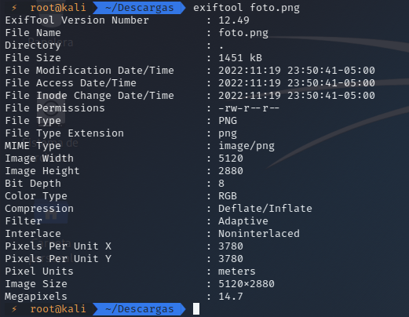
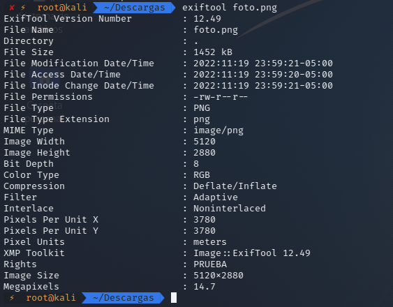
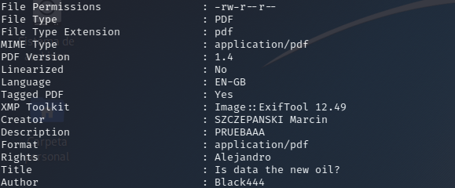

# Análisis de metadatos con Exiftool

<br>

<p align="center">

</p>

<br>

Por si no lo tienes muy claro, los metadatos o datos EXIF (Exchangeable Image File) son datos que nos dan información muy detallada sobre fotografías, vídeos y audios digitales.

Recabar información valiosa para una investigación: pueden ayudarte a situar un evento o una persona o conocer la cámara o el teléfono con el que se ha tomado una imagen, y en definitiva, hacerte con datos que puedan arrojar luz al caso en el que estés trabajando.

**Borrar tus propios datos:** Como investigador debes mantener tu información personal lo más oculta posible y evitar dejar huellas que puedan comprometerte.

Así que si necesitas acceder a los metadatos para lograr alguna de estas dos cosas, te enseño cómo hacerlo con una herramienta muy completa: ExifTool.

<br>

## Instalación

```
sudo apt-get install exiftool
```

<br>

## USO

<br>

Una vez lo hemos instalado, ahora toca utilizarlo en un archivo con el siguiente comando:

```
exiftool nombre_archivo
```

<br>

<p align="center">

</p>

<br>

Como podemos ver los los metadatos de la imagen como las medidas de la imagen etc.

Ahora pasamos a explicar como añadir o editar los metadatos de la imagen:

```
exiftool -rights="PRUEBA" CopyrightNotice="Filter" foto.png
```

<br>

<p align="center">

</p>

<br>

Para añadir solo escribimos un campo con un nuevo valor.

```
exiftool -description="PRUEBAAA" -CopyrightNotice="PRUEBAAA" Prueba.pdf
```

<br>

<p align="center">

</p>

<br>

Ahora primero seleccionamos el campo que deseamos editar en esta caso **Description** seleccionamos y le damos un nuevo valor.