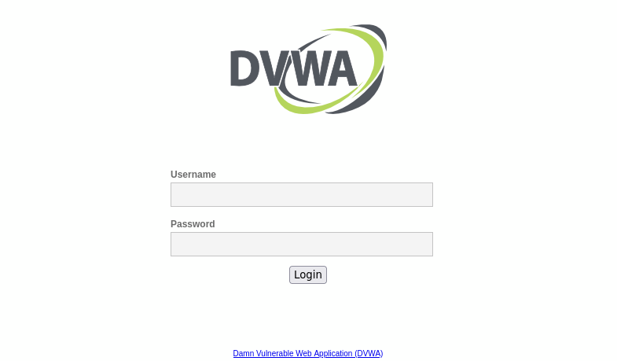

# DVWA (Damn Vulnerable Web App)

<br>

<p align="center">

</p>

<br>

DVWA (Damn Vulnerable Web Application) es una aplicación web deliberadamente insegura y vulnerable, diseñada con fines educativos y de pruebas de seguridad. Fue creada para que los desarrolladores, estudiantes y profesionales de la seguridad informática puedan practicar y aprender sobre las vulnerabilidades comunes que se encuentran en las aplicaciones web.

DVWA proporciona un entorno controlado donde se simulan diversas vulnerabilidades conocidas, como inyecciones de SQL, cross-site scripting (XSS), desbordamientos de búfer, autenticación débil, entre otras. Los usuarios pueden explorar y explotar estas vulnerabilidades utilizando diferentes técnicas y herramientas, siempre con el objetivo de comprender cómo funcionan y cómo prevenirlas.

Al ser una aplicación deliberadamente vulnerable, se recomienda utilizar DVWA solo en un entorno seguro y aislado, como una máquina virtual o un entorno de pruebas. Además, es importante utilizarla con responsabilidad y ética, evitando cualquier intento de utilizarla para fines maliciosos.

DVWA es un recurso ampliamente utilizado en el campo de la seguridad informática y puede ser útil tanto para principiantes como para profesionales con experiencia. Proporciona una plataforma de aprendizaje interactiva que permite a los usuarios adquirir conocimientos prácticos sobre las vulnerabilidades web y fortalecer las habilidades de mitigación de riesgos y protección de aplicaciones.

## Instalación:

```
sudo apt-get install docker.io

docker pull vulnerables/web-dvwa

docker run --rm -it -p 80:80 vulnerables/web-dvwa
```

<br>

<p align="center">

</p>

<br>

El usuario y contraseña por defecto es **admin** y **password**.