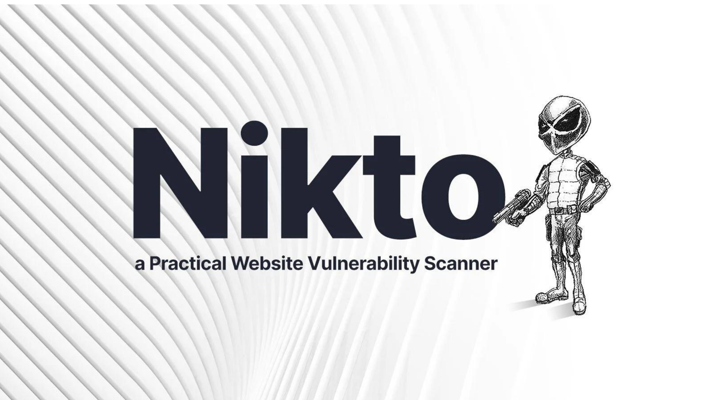
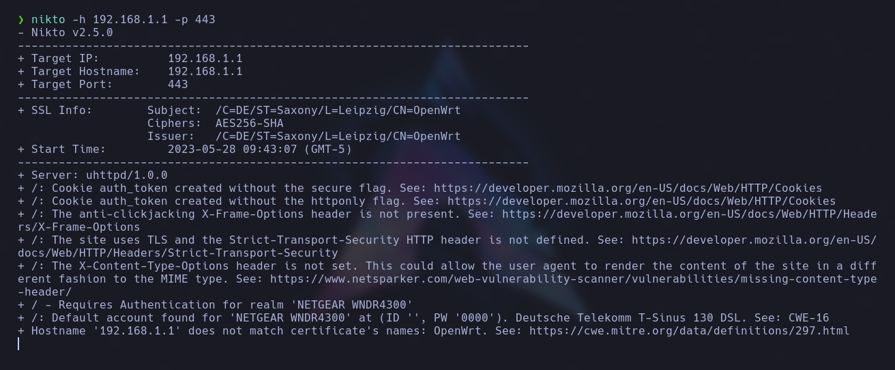

# Nikto

<br>

<p align="center">

</p>

<br>

Nikto es una herramienta de seguridad utilizada para realizar evaluaciones de vulnerabilidades en aplicaciones web. Nikto se enfoca en buscar posibles vulnerabilidades y puntos débiles en servidores web y aplicaciones en línea.

Nikto realiza un escaneo exhaustivo de un objetivo específico, como un sitio web, y busca vulnerabilidades conocidas, configuraciones incorrectas y problemas de seguridad comunes. Examina aspectos como la configuración del servidor, los directorios y archivos expuestos, las versiones de software utilizadas y las posibles fallas en la implementación de protocolos de seguridad.

## Instalación

```
sudo apt-get install nikto
```

## USO

Para hacer un simple escaneo de una ip y un puerto lo haríamos con el siguiente comando:

```
nikto -h <Hostname/IP> -p <port>
```

<p align="center">

</p>

Escaneo de varios puertos:

```
nikto -h <Hostname/IP> -port <port>,<port>
```

Especificar un tiempo máximo de escaneo:

```
nikto -h <Hostname/IP> -maxtime <número en segundos>
```

Forzar el uso de ssl:

```
nikto -h <Hostname/IP> -ssl
```

Deshabilitar el uso de ssl:

```
nikto -h <Hostname/IP> -nossl
```

Evitar mostrar errores 404:

```
nikto -h <Hostname/IP> -no404
```

Ignorar ciertos códigos de estado 30x,40x,50x:

```
nikto -h <Hostname/IP> -IgnoreCode <Código de estado>
```

Especificar la cabecera del host:

```
nikto -h <Hostname/IP> -vhost
```

Exportar los resultados a fichero

```
nikto -h  <Hostname/IP> -output <filename>
```

Escanear a través de un proxy:

```
nikto -h  <Hostname/IP> -userproxy <Proxy IP>
```

Indicar los datos de autenticación:

```
nikto -h  <Hostname/IP> -id <id:pass> or <id:pass:realm>
```

Actualizar los plugins y la base de datos:

```
nikto -update
```

Comprobar el estado de la base de datos:

```
nikto -h <Hostname/IP> -dbcheck
```

Especificar un fichero de configuración:

```
nikto -h <Hostname/IP> -config <nikto.conf>
```

Deshabilitar la resolución de nombres:

```
nikto -h <Hostname/IP> -nolookup
```

Deshabilitar la respuesta en caché:

```
nikto -h <Hostname/IP> -nocache
```

Deshabilitar características que requieran interacción por parte del usuario:

```
nikto -h <Hostname/IP> -nointeractive
```

## Opciones de evasion

```
nikto -h <Hostname/IP> -evasion <Option>
```

1. Codificación aleatoria de URI
2. Auto-referencia de directorio /./
3. URL final prematura
4. Anteponer una cadena aleatoria larga
5. Parámetro falso
6. TAB como espaciador de solicitud
7. Cambiar el caso de la URL
8. Separador de directorio de Windows usado \
     * Utilice un retorno de carro (0x0d) como espaciador de solicitud

     * Utilice el valor binario (0x0b) como espaciador de solicitud

## Especificar el formato del fichero de salida

```
nikto -h <Hostname/IP> -Format <Option>
```

* csv -> Comma Separated Value
* htm -> formato HTML
* msf+ -> formato utilizado por Metasploit
* nbe -> formato utilizado por Nessus
* txt -> texto plano
* xml -> formato XML

## Tuning

```
nikto -h <Hostname/IP> -Tuning <Option>
```

1 -> archivo interesante

2 -> configuración incorrecta

3 -> Divulgación de información

4 -> Inyección (XSS / Script / HTML)

5 -> Recuperación remota de archivos: internal web root

6 -> Denegación de servicio

7 -> Recuperación remota de archivos: todo el servidor

8 -> Ejecución de comandos – Shell remoto

9 -> inyección SQL

0 -> carga de archivos

a -> bypass de autenticación

b -> Identificación del software

c -> Inclusión de fuente remota

x -> Opción de sintonización inversa

## Mutate

```
nikto -h <Hostname/IP> -mutate <Option>
```

1. Testear todos los ficheros en el directorio raíz
2. Adivina los nombres de los archivos con contraseña
3. Enumerar nombres de usuario a través de apache
4. Enumerar nombres de usuario a través de cgiwrap
5. Intento de nombres de subdominios por fuerza bruta
6. Intente adivinar los nombres de directorio de un archivo.

[https://byte-mind.net/escanear-un-servidor-web-utilizando-nikto/](https://byte-mind.net/escanear-un-servidor-web-utilizando-nikto/)