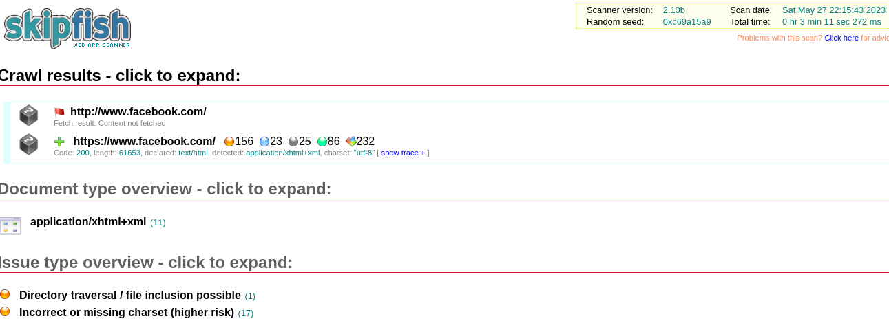

# Skipfish

<br>

<p align="center">

</p>

<br>

Skipfish es una herramienta activa de reconocimiento de seguridad de aplicaciones web. Prepara un mapa del sitio interactivo para el sitio de destino mediante el rastreo recursivo y la detección basada en diccionario. El mapa final luego se anota con la salida de muchas comprobaciones de seguridad activas (pero con suerte ininterrumpidas). El informe final generado por la herramienta está destinado a servir como base para la evaluación profesional de la seguridad de las aplicaciones web.

## Instalación

```
sudo apt-get install skipfish
```

## USO

```bash
• skipfish -o test http://www.facebook.com
• -X no comprueba las URL que contienen ´string´ # Por ejemplo: cerrar sesión
• -K no realiza la prueba Fuzz en parámetros especificados
• -D Rastrear otro dominio a través de sitios
• -l número máximo de solicitudes por segundo
• -m Número máximo de conexiones simultáneas por IP
• --config especifica el archivo de configuración
```

```python
root@kali:~# skipfish -o test2 http://172.16.10.133/dvwa/
    skipfish web application scanner - version 2.10b
    [!] WARNING: Wordlist '/dev/null' contained no valid entries.
    Welcome to skipfish. Here are some useful tips:

    1) To abort the scan at any time, press Ctrl-C. A partial report will be written
       to the specified location. To view a list of currently scanned URLs, you can
       press space at any time during the scan.

    2) Watch the number requests per second shown on the main screen. If this figure
       drops below 100-200, the scan will likely take a very long time.

    3) The scanner does not auto-limit the scope of the scan; on complex sites, you
       may need to specify locations to exclude, or limit brute-force steps.

    4) There are several new releases of the scanner every month. If you run into
       trouble, check for a newer version first, let the author know next.

    More info: http://code.google.com/p/skipfish/wiki/KnownIssues

    Press any key to continue (or wait 60 seconds)... 

    skipfish version 2.10b by lcamtuf@google.com

      - 172.16.10.133 -

    Scan statistics:

          Scan time : 0:05:25.024
      HTTP requests : 6954 (22.3/s), 162897 kB in, 4840 kB out (516.1 kB/s)  
        Compression : 0 kB in, 0 kB out (0.0% gain)    
        HTTP faults : 2 net errors, 0 proto errors, 0 retried, 0 drops
     TCP handshakes : 79 total (115.6 req/conn)  
         TCP faults : 0 failures, 2 timeouts, 1 purged
     External links : 136747 skipped
       Reqs pending : 2181        

    Database statistics:

             Pivots : 315 total, 7 done (2.22%)    
        In progress : 169 pending, 56 init, 77 attacks, 6 dict    
      Missing nodes : 6 spotted
         Node types : 1 serv, 80 dir, 12 file, 3 pinfo, 107 unkn, 112 par, 0 val
       Issues found : 33 info, 1 warn, 80 low, 12 medium, 0 high impact
          Dict size : 219 words (219 new), 14 extensions, 256 candidates
         Signatures : 77 total

    [!] Scan aborted by user, bailing out!
    [+] Copying static resources...
    [+] Sorting and annotating crawl nodes: 315
    [+] Looking for duplicate entries: 315
    [+] Counting unique nodes: 314
    [+] Saving pivot data for third-party tools...
    [+] Writing scan description...
    [+] Writing crawl tree: 315^[[A
    [+] Generating summary views...
    [+] Report saved to 'test1/index.html' [0x1d859466].
    [+] This was a great day for science!
```

<p align="center">

</p>