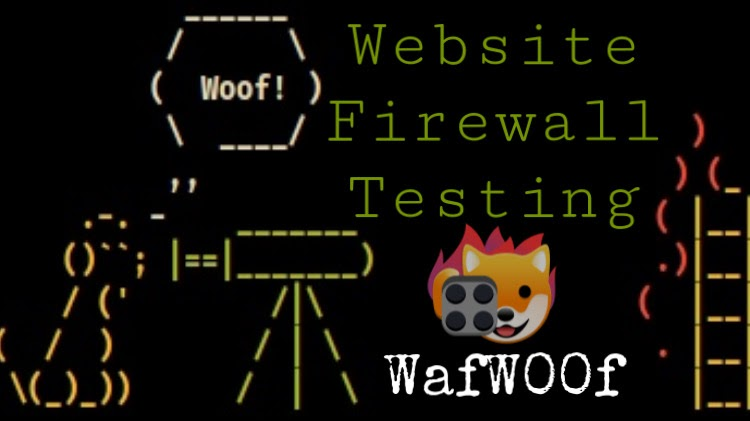
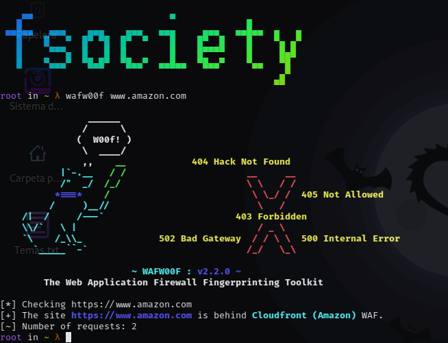
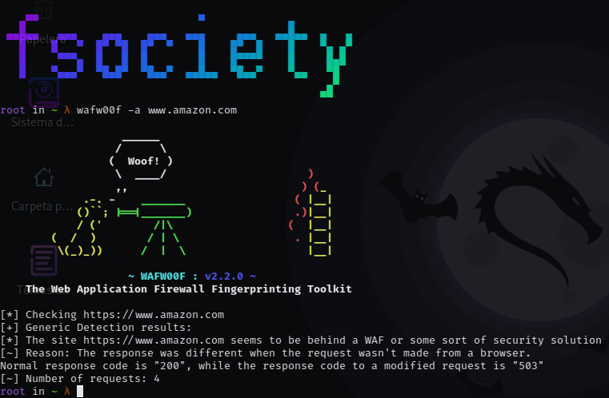

# Escaneo de firewall web con Wafw00f

<br>

<p align="center">

</p>

<br>

Herramienta de nombre “wafw00f”, para conocer la existencia de un firewall para aplicaciones web, entre los clientes o usuarios y el sitio web. Wafw00f envía peticiones HTTP normales y analiza las respuestas; esto identifica diversas soluciones WAF.

<br>

## Instalación

```
apt-get install wafw00f
```

<br>

## USO

Uso de la herramienta wafw00f para averiguar si la seguridad del firewall está detrás de un dominio.

```
wafw00f www.amazon.com
```

<br>

<p align="center">

</p>

<br>

Como podemos ver tiene un firewall Cloudfront.

```
wafw00f -a www.amazon.com
```

<br>

<p align="center">

</p>

<br>

Uso de wafw00f para escanear un objetivo con Nmap Scripts. 

```
nmap -p 80,443 --script=http-waf-detect equifaxsecurity2017.com
```

<br>

<p align="center">

</p>

<br>