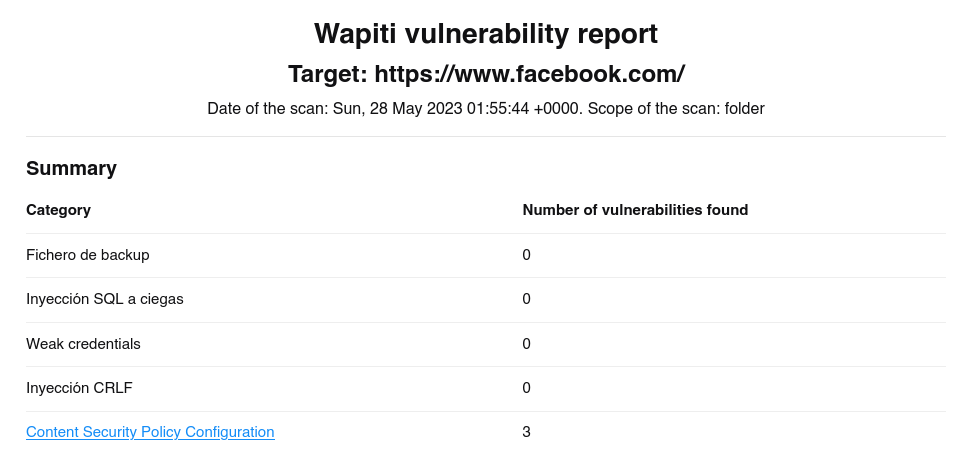

# Wapiti

<br>

<p align="center">

</p>

<br>

Wapiti es una herramienta de seguridad informática que se utiliza para evaluar la vulnerabilidad de aplicaciones web. Su objetivo principal es detectar posibles agujeros de seguridad y vulnerabilidades en el código y la configuración de una aplicación web. Wapiti realiza pruebas de penetración automatizadas en la aplicación y busca vulnerabilidades comunes como inyecciones de SQL, ataques de cross-site scripting (XSS), inclusión de archivos locales y más.

Algunas de las características y funcionalidades de Wapiti son:

1. **Escaneo exhaustivo:** Wapiti realiza un escaneo completo de la aplicación web en busca de vulnerabilidades conocidas.

2. **Soporte para varios lenguajes y tecnologías:** Puede utilizarse para analizar aplicaciones web escritas en diversos lenguajes de programación y frameworks, como PHP, ASP.NET, Java, Ruby, entre otros.

3. **Detección de vulnerabilidades comunes:** Wapiti está diseñado para encontrar vulnerabilidades ampliamente conocidas y explotadas, como inyecciones de código SQL, XSS, inclusión de archivos locales y más.

4. **Generación de informes detallados:** La herramienta genera informes detallados después de cada escaneo, que incluyen información sobre las vulnerabilidades encontradas, los archivos y las líneas de código afectadas, y sugerencias para remediar los problemas.

5. **Personalización y configuración:** Wapiti permite personalizar y configurar el alcance del escaneo, los parámetros de búsqueda, los patrones de exclusión, entre otros aspectos, según las necesidades del usuario.

## Instalación

```
sudo apt-get install john
```

## USO

```
sudo wapiti -u <url> -o <ubicacion donde se guardara el escaneo>
```

Ejemplo:

```
sudo wapiti -u https://www.facebook.com/ -o /home/usuario
```

Y nos creara un informe completo sobre la pagina web.

<p align="center">

</p>
