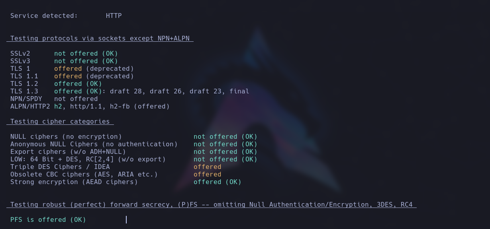
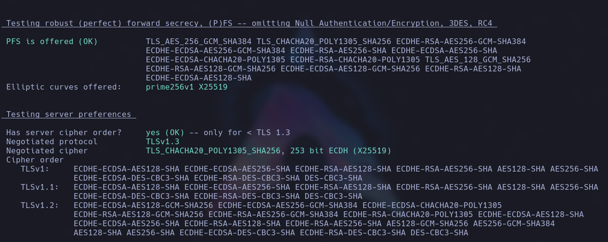

# testssl.sh

testssl.sh es una herramienta de línea de comandos gratuita que verifica el servicio de un servidor en cualquier puerto para admitir cifrados TLS/SSL, protocolos, fallas criptográficas recientes y más.

## Instalación
```
sudo apt-get install testssl.sh
```

## USO
```
testssl [options] <URL>
```

Ejemplo:

```
testssl https://www.facebook.com
```

Para verificar los protocolos activados por STARTTLS como: ftp, smtp, pop3, imap, xmpp, telnet, ldap, postgres, mysql, para ello debemos usar la opción -t

```
testssl.sh -t smtp https://www.facebook.com/
```

<p align="center">

</p>

<p align="center">

</p>