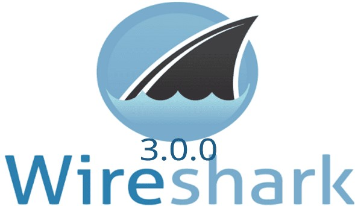
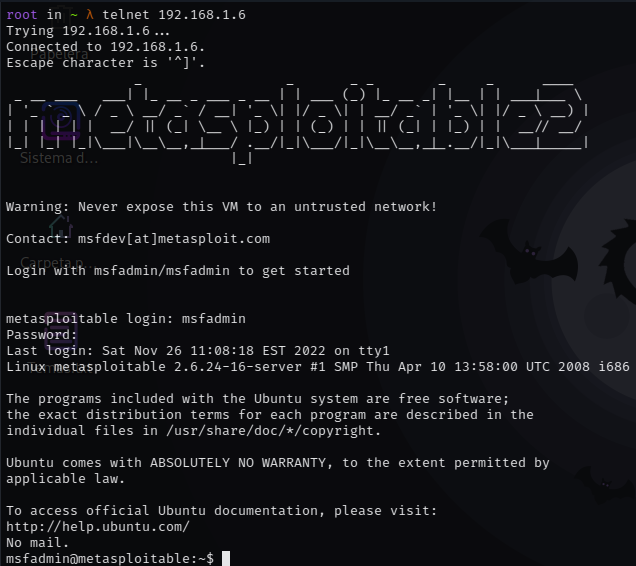
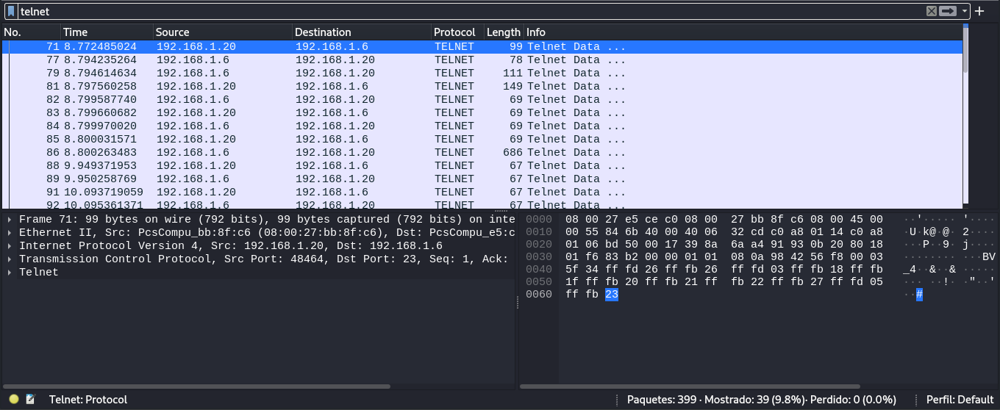
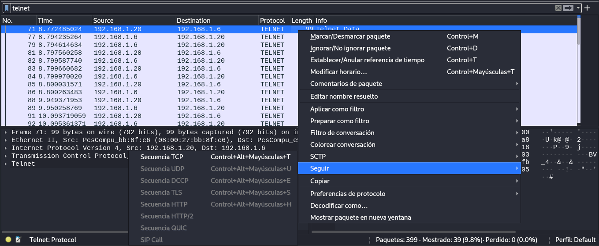
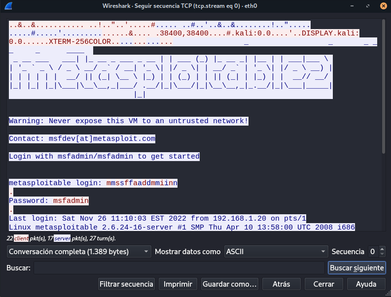

# Análisis con Wireshark

<br>

<p align="center">

</p>

<br>

Se trata de un software gratuito que permite analizar el tráfico red en tiempo real.

La herramienta intercepta el tráfico y lo convierte en un formato legible para las personas. 

Esto hace que sea más fácil identificar qué tráfico está cruzando la red, con qué frecuencia y la latencia que hay entre ciertos saltos. Si bien Wireshark admite más de 2.000 protocolos de red, muchos de ellos inusuales o antiguos, los profesionales encuentran una gran utilidad en el análisis de identidades IP. La mayoría de los paquetes son TCP, UPD e ICMP.

<br>

## Instalación

```
sudo apt-get install wireshark
```

<br>

## USO

Primero abriremos wireshark y seleccionaremos la interface **eth0** para el análisis de tráfico.

<br>

<p align="center">

</p>

<br>

Luego usaremos telnet para conectarnos a la maquina remota.

```
telnet 192.168.1.6
```

<br>

<p align="center">

</p>

<br>


El usuario y contraseña por defecto es msfadmin.

Una vez conectados volveremos a wireshark y vermos todo el trafico interceptado luego buscaremos **telnet**.

<br>

<p align="center">

</p>

<br>

Ahora en seleccionamos la opción **Secuencia TCP**.

<br>

<p align="center">

</p>

<br>

Y obtendremos credenciales del incio de sesión con telnet.

<br>

<p align="center">

</p>

<br>

**NOTA:** Esto se puede usar también con el protocolo **HTTP** inseguro.

