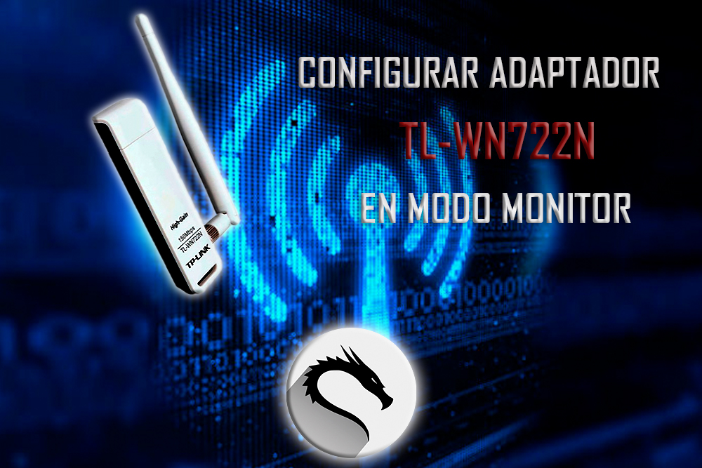
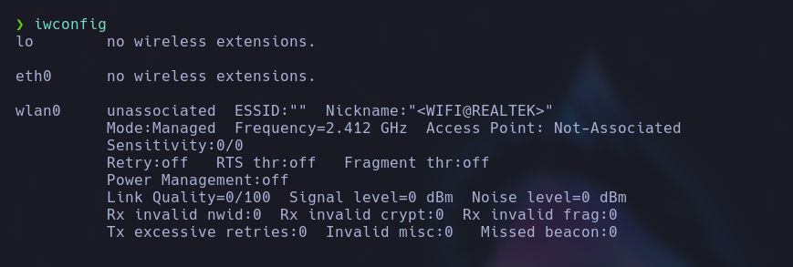
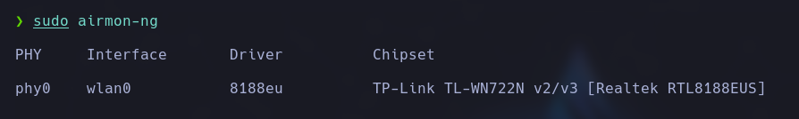
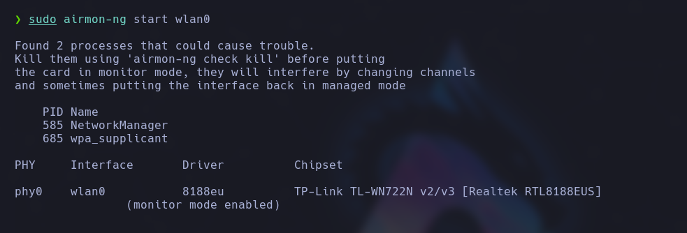

# Tp-link tl wn722n

<br>

<p align="center">

</p>

<br>

El modo monitor es una función especial en las tarjetas de red inalámbricas que les permite operar en un modo pasivo, en lugar de funcionar en el modo estándar de cliente o punto de acceso. En el modo monitor, la tarjeta de red puede capturar y analizar todos los paquetes de datos que se transmiten a través del canal inalámbrico en el que está operando.

A diferencia del modo cliente, donde la tarjeta de red solo puede recibir y enviar paquetes destinados a ella, en el modo monitor, la tarjeta de red puede capturar todos los paquetes que se transmiten en su rango, incluso aquellos destinados a otros dispositivos. Esto permite realizar análisis de red, monitorear el tráfico, realizar auditorías de seguridad y realizar pruebas de penetración en redes inalámbricas.

## Instalación

```
sudo apt-get install realtek-rtl8188eus-dkms

reboot
```

## USO

Para poner el adaptador en modo monitor debemos saber cual es la interface de nuestro adaptador.

```
iwconfig
```

<p align="center">

</p>

Luego de esto vamos a ver que nuestro adapatador tiene el modo monitor.

```
sudo airmon-ng
```

<p align="center">

</p>

Ahora vamos a activar el modo monitor de nuestro adaptador.

```
sudo airmon-ng start wlan0

iwconfig
```

<p align="center">

</p>

<p align="center">

</p>
